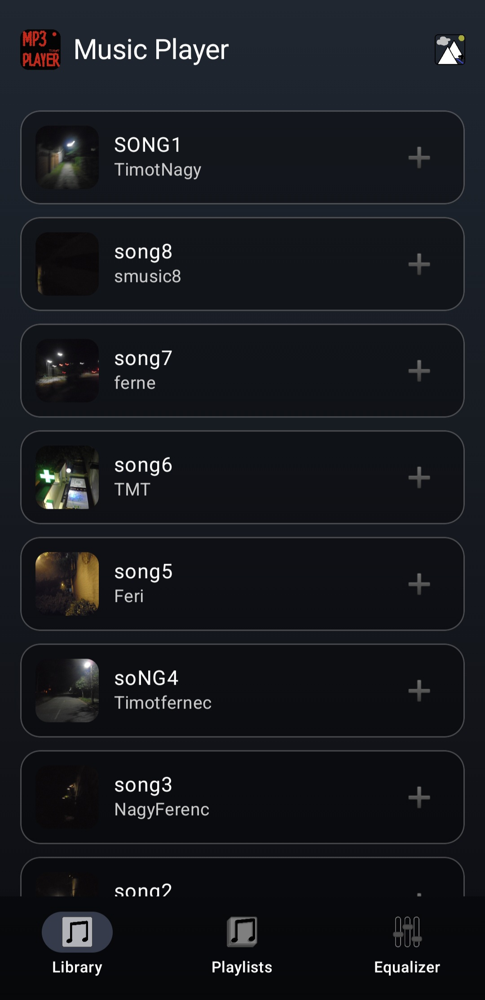
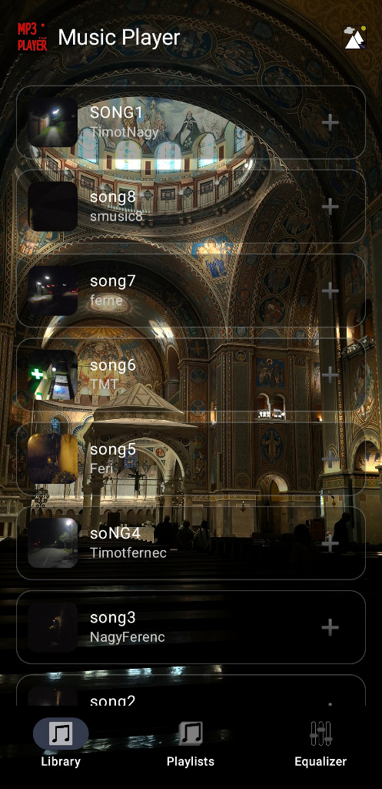
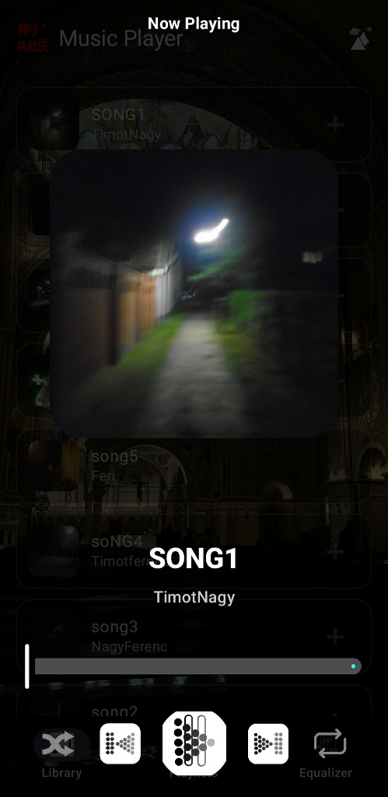
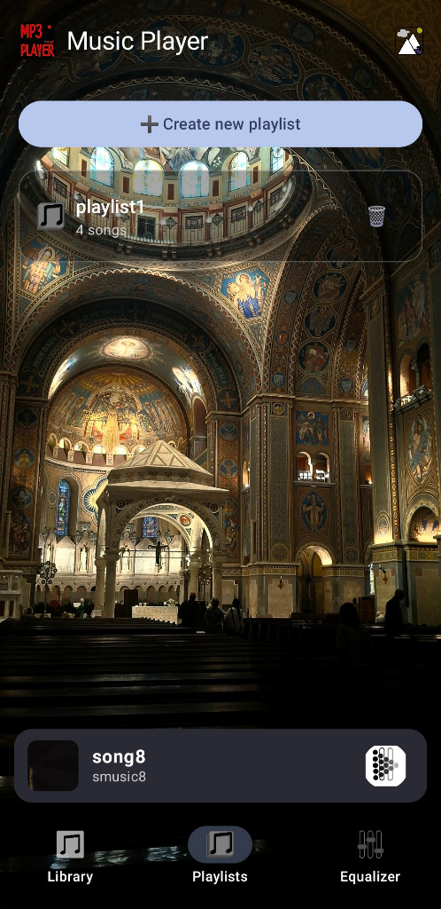
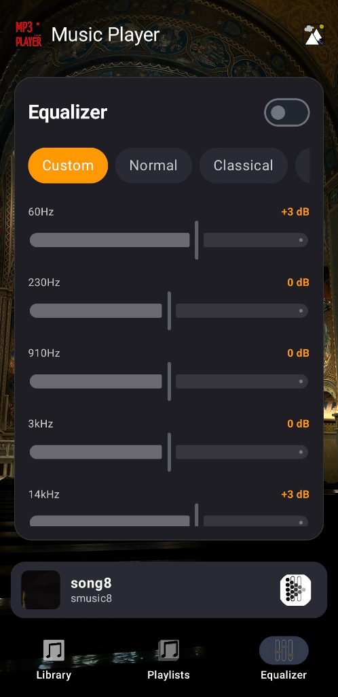

# MP3 Player

An Android music player application built with Jetpack Compose and Material 3, featuring background playback, a full-screen player view, a multi-band Equalizer, playlist management, customizable background wallpapers, and full Android Media Notification controls.

[Download Latest APK](https://github.com/TIMOT-nagy/MP3Player/releases/latest)

---

## Screenshots

<p align="center">
  
  
  
  
  
</p>

---

## Features

* Media Notifications & Lock Screen Controls: Full integration with MediaSessionCompat and NotificationCompat.MediaStyle to display interactive media cards in Quick Settings, lock screen, and external Bluetooth devices.
* Full-Screen Player: Dedicated view featuring large album artwork, seek bar, playback controls, shuffle, and repeat modes.
* Multi-Band Equalizer: Built-in frequency adjustment with real-time decibel feedback and preset configurations (Normal, Classical, etc.).
* Playlist Management: Create custom playlists, add or remove tracks, and organize music collections.
* Custom Wallpapers: Select and apply custom background images from the local device gallery with persistent storage.
* Embedded Cover Art Extraction: Automatic extraction and rendering of embedded MP3 album artwork.
* Modern Compose UI: Built with Material 3 navigation and reactive UI components.

---

## Tech Stack

* Language: Kotlin
* UI Framework: Jetpack Compose + Material 3
* Architecture: MVVM (Model-View-ViewModel) + Jetpack State Management
* Audio Engine: android.media.MediaPlayer + android.media.audiofx.Equalizer
* Background Playback: Foreground Service + MediaSessionCompat
* Image Loading: Coil (Compose Image Loader)

---

## Required Permissions

The application declares the following permissions in AndroidManifest.xml:

```xml
<uses-permission android:name="android.permission.READ_MEDIA_AUDIO" />
<uses-permission android:name="android.permission.READ_EXTERNAL_STORAGE" android:maxSdkVersion="32" />
<uses-permission android:name="android.permission.POST_NOTIFICATIONS" />
<uses-permission android:name="android.permission.FOREGROUND_SERVICE" />
<uses-permission android:name="android.permission.FOREGROUND_SERVICE_MEDIA_PLAYBACK" />
